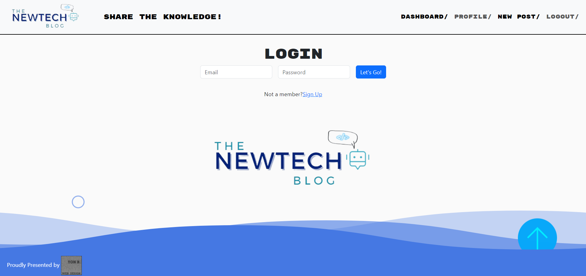

# The-NewTech-Blog

## Description

- Use 

## Technical Skills

## Table of Contents

- [Access](#access)
- [Visuals](#visuals)
- [Credits](#credits)
- [License](#license)
- [Features](#features)
- [How to Contribute](#how-to-contribute)

## Visuals

---

---

## Credits

- Melany Pietrowski [**Melpie10**](https://github.com/Melpie10) for all your constructive 
comments and infinite patience when a concept proves difficult to understand.

-The four Codesmen- (myself being one of)
- Edwin Pietrowski [**BogartDME**](https://github.com/BogartDME)
- Denart Ifurung [**Difurung**](https://github.com/Difurung)
- Charles Beatty [**Seabass**](https://github.com/beattycharles)

## License

Copyright (c) [2023] [Yonatan Yael Bermudez Diez]

## Features

- Fully functional social media hub.
    - Create read and delete posts.
    - Check user's profile.
    - Make Comments to the User's posts
    - Bcrypt security.

## How to Contribute

Constructive Comments are always welcome. e-mail me: yon_baermund@hotmail.com

(<a href="#top">Back to top</a>)

